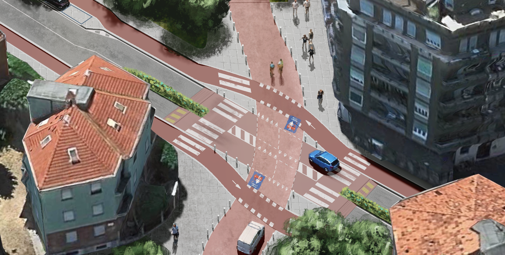

# 🚲 PensaMi Ciclabile

  

Hello! 👋 **PensaMi Ciclabile** is an independent initiative focused on improving urban cycling through digital tools, open data, and civic advocacy.

This GitHub organization hosts projects that support safer, more transparent, and data-driven bicycle infrastructure, starting from Milan, Italy.

---

## What We Do

### 📸 Instagram

We re-draw parts of Milan to imagine and propose a more bike-friendly city, in line with our broader mission. Instagram helps us stay connected with the community and share this vision with local citizens:
[https://www.instagram.com/pensamiciclabile/](https://www.instagram.com/pensamiciclabile/)

### 🌐 Website

We publish analyses, ideas, and resources about cycling infrastructure and urban mobility:
[https://pensamiciclabile.it](https://pensamiciclabile.it)

### 💻 Open Source

We build and share tools that support cycling advocacy.

**velotrack** is our main open source project for Milan, focused on collecting and visualizing cycling data:
[https://github.com/pensami-ciclabile/velotrack](https://github.com/pensami-ciclabile/velotrack)

---

## About

The organization is maintained by [me](https://www.danielsc4.it). It is an individual initiative designed to remain open, collaborative, and reusable. See more about the project and how to reach out on the [official website](https://pensamiciclabile.it).
